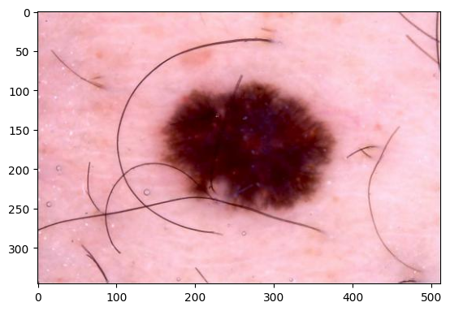
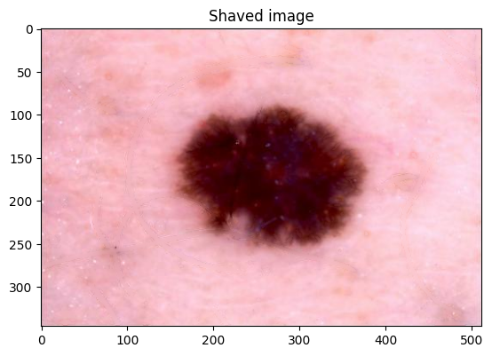
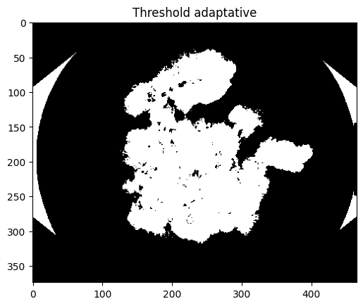
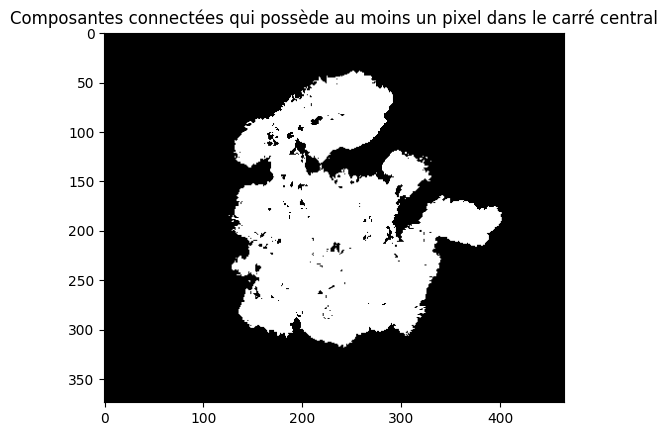
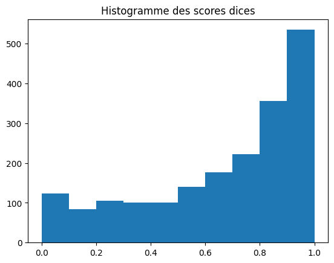

# Kaggle IMA205 Challenge: Skin Lesion Segmentation and Classification

## Introduction
This project focuses on the segmentation and classification of skin lesions using machine learning techniques. The approach is based on several research articles, with additional personal enhancements to improve results, particularly in pre-processing and post-processing stages.

## Methodology

### Pre-processing
- **Cropping**: Images are cropped to remove black borders, ensuring the median skin color is accurately represented.
- **Hair Removal**: The DullRazor algorithm is used to digitally shave images, reducing noise from hair in the segmentation process.

### Segmentation
- **Median Filtering**: A median filter with a kernel size of 10 pixels is applied to denoise the image.
- **Color Space Transformation**: The image is converted to the LAB color space, and medians for each channel are calculated.
- **Thresholding**: An adaptive thresholding method is applied, combining Otsu's method and the SWOT method to improve segmentation accuracy.
- **Connected Components**: An algorithm is used to correct segmentation issues by focusing on labels present in the central region of the image.

### Post-processing
- **Morphological Operations**: Filling holes in the mask and inverting the mask if necessary to correct segmentation errors.
- **Performance Evaluation**: Dice scores are calculated to evaluate segmentation performance, with a median score of 0.77.
- **Dice Score Histogram**:
  

### Feature Extraction
- **Color Features**: Various color-based features are extracted, including mean values and ratios of RGB channels within the lesion and skin areas.
- **Shape Features**: Features related to the asymmetry and border of the lesion are extracted.

### Machine Learning
- **SVM Classification**: A Support Vector Machine (SVM) with a Gaussian kernel is used for classification, achieving a test score of 0.7 and a submission score of approximately 0.5.
- **CNN Classification**: A Convolutional Neural Network (CNN) based on ResNet-101 is trained, achieving a public score of 0.473 and a private score of 0.420.

## Results
- **Segmentation**: The segmentation process generally produces satisfactory results but struggles with images where skin is not the majority.
- **Classification**: The SVM model shows promising results, while the CNN model provides a baseline that needs further improvement.

## Bibliography
- [1] L. Xu et al., "Segmentation of skin cancer images."
- [2] She Z et al., "Combination of features from skin pattern and ABCD analysis for lesion classification."
- [3] Celebi ME et al., "Automatic detection of blue-white veil and related structures in dermoscopy images."
- [4] Md. Kamrul Hasan et al., "A survey, review, and future trends of skin lesion segmentation and classification."
- [5] Konstantin Korotkov et al., "Computerized analysis of pigmented skin lesions: A review."
- [6] Maciel Zortea et al., "A simple weighted thresholding method for the segmentation of pigmented skin lesions in macroscopic images."

## Conclusion
This project demonstrates a comprehensive approach to skin lesion segmentation and classification, with potential for further improvement in feature extraction and segmentation accuracy.
